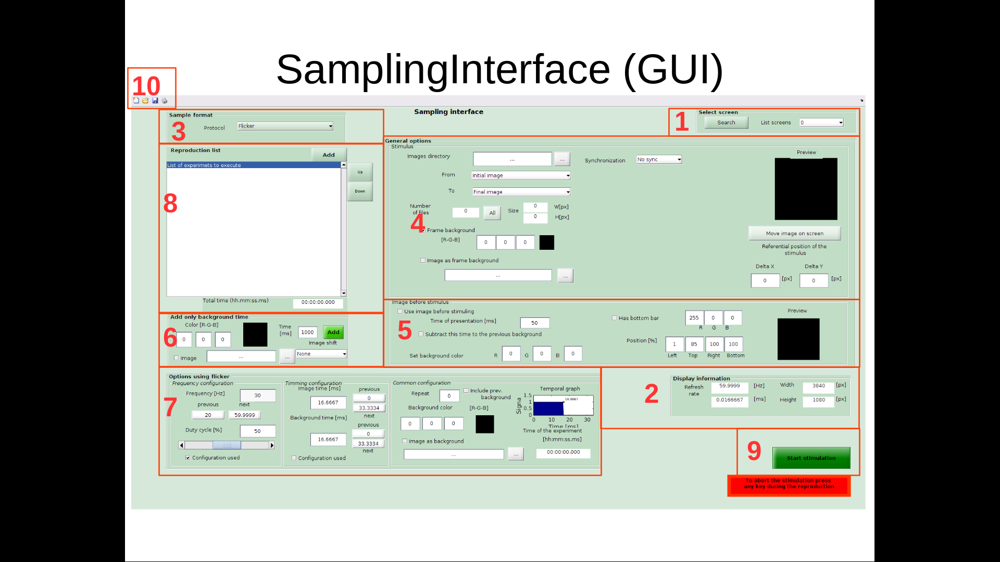
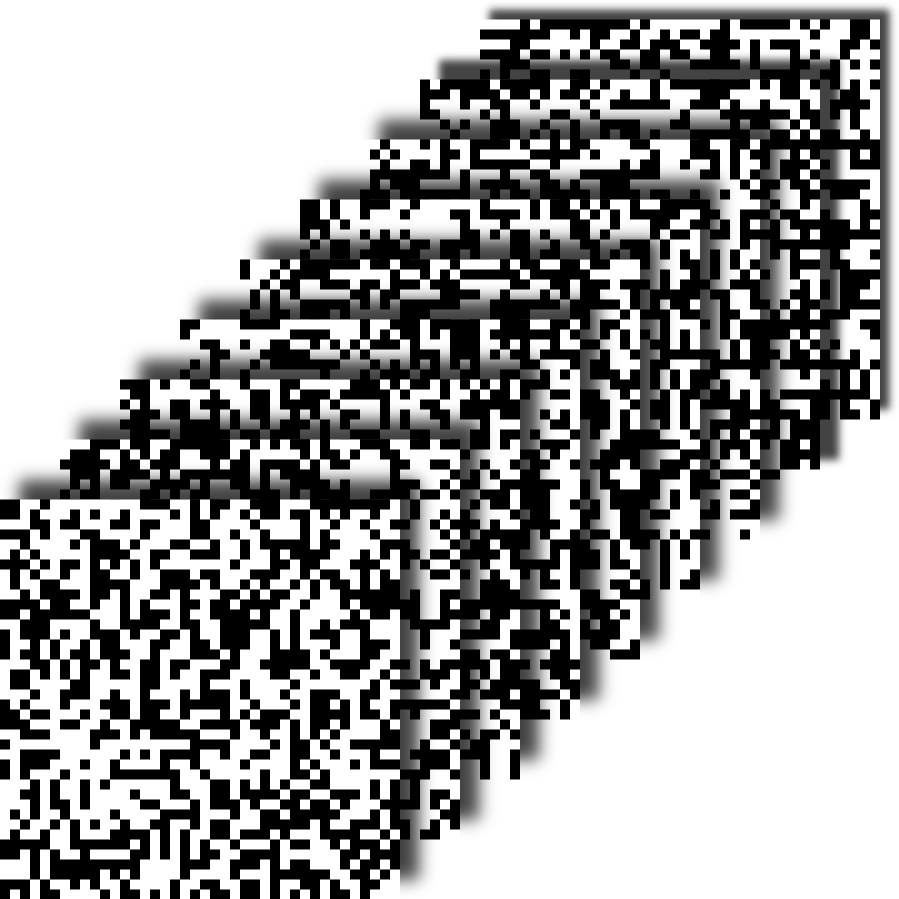
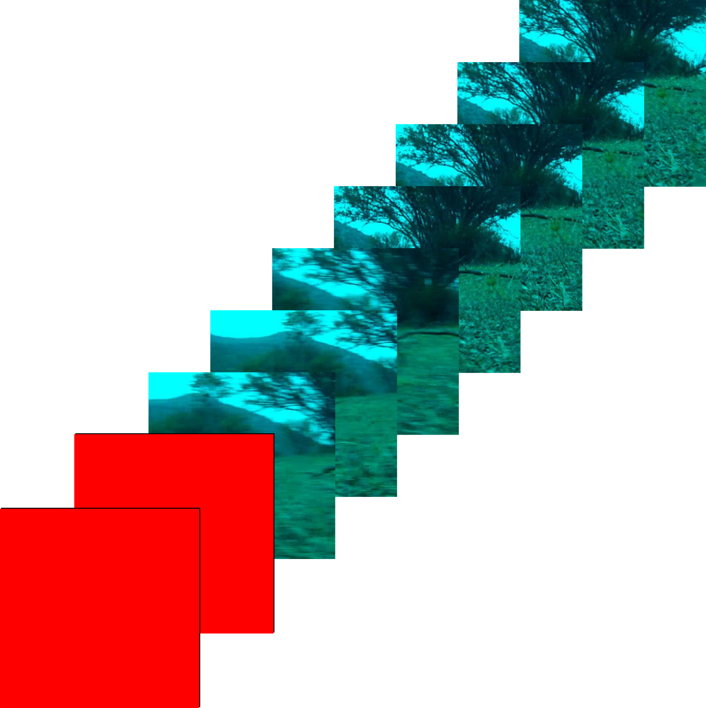
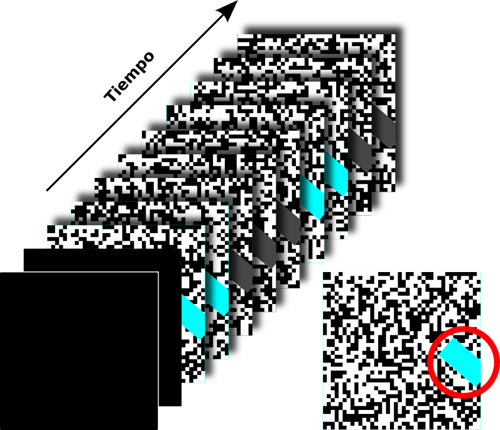
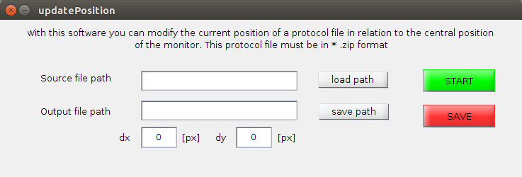
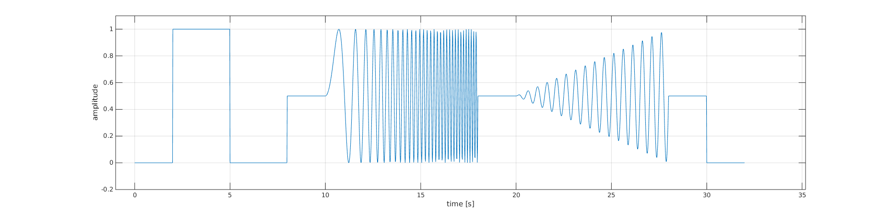

# User guide for SamplingInterface 

Please read this manual before operating this software.
## Introduction 
Sampling Interface (v2.0) is a software that can display visual stimuli, it was developed with the intention of use the characteristic of synchronization with refresh rate of screen offered by [Psychophysics Toolbox](http:*www.psychtoolbox.org/). This software was developed in Matlab and was optimized to work in MacOS, but also work in GNU/Lunux and Windows.

This software can load a sets of images and set how this will be show, existing different protocols types with different parameters that available to do that you need. You can load as many sets as you need, you only need add this set to the playlist, and also you can add adaptation time if is necessary.

This document show how install, use and create some clasic protocols in Sampling Interface.

## Install 
### Pre-requisite
Sampling Interface was developed to work in anything Operative System (Mac OS, GNU/Linux, Win), it only need to have still the follow requisites:
  * Ram > 4GB     
  * Matlab > v2012     
  * [Psychophysics Toolbox](http:*www.psychtoolbox.org/) > v3.0. The installing has to add the functions to Matlab library for correct work, it hasn't to work from ptb3-matlab.   
### Install
The code is hosted in [Github](https:*github.com/creyesp/SamplingInterface) where you can download the latest version in this [link](https:*github.com/creyesp/SamplingInterface/archive/master.zip).

After that you download the code you have to extract content from that file, open Matlab and execute the SamplingInterface script inside the 'Code/' folder that will show a window where you can create the protocols you want.

Inside the SamplingInterface folder exist 3 subfolders for the correct use of software, 'Stim/', 'Protocols/' and 'Log/'. The first is the place where you save the images useded in the protocols, the second is the place where you have to save the protocols and the last is the place where it save the log file for each protocol run.

## Run SI
SamplingInterface has 2 parts, the first create the file that keep the information of playlist of protocols that will show. You can run this part writing this line in Matlab

> SamplingInterface

the second part is only to show that protocols in the screen. The name of the script is stimulation and you can run this part writing this line in Matlab

> Stimulation('../protocols/WN.zip')

in this case '../protocols/WN.zip' is the path of the protocols. Only in this case the protocols make a log file. A alternative way for this second part is run the command file, when you save a protocols in the first part the software ask you if you want create this file that is a executable file for run directly the protocols created without open the Matlab. So, you only need execute the command file as this example:

> $ WN.command
   
For more information you can see the manual in [PDF](https:*github.com/creyesp/SamplingInterface/raw/master/Doc/Manual_de_usuario_para_SamplingInterface_v2.pdf), here you will find specific information about parameters of configuration in each protocol type.
## Examples 

### Light Flash
This example describe the procedure to create a light flash protocol with the following properties:

* 400 [ms] of light in cyan colour and maximum intensity (On period)    
* 1000 [ms] of darkness (Off period)     
* Use 20 repetitions     
* Use a adaptation period for 1000 [ms] and red colour at the begin and end of protocol.     
* Use analog synchronize      

So, open the SamplingInterface and following this steps:

- **In panel 6**, set the time and the color for the adaptation stimulus, so you put Time: 1000 and Color: [255,0,0]. After, for you add this to the playlist (panel 8) you must do click in add button of panel 6.     
- **In panel 3** choose the *Protocol: Flicker* option.     
- **In panel 4** in the option Images directory , choose the folder where you find an image with cyan colour, maximum intensity and select it in the list from, to.     
- **In panel 4** choose Synchronization: Analog option and set the default parameters.     
- **In panel 4** click in *Move images on screen* and set the images position in the screen.     
- **In panel 7**  choose the *configuration used* checkbox option in Timming configuration and set *image time: 400* and *Background time: 1000*.     
- **In panel 7** set *repeat: 19* (show the first presentation and repeat it 19 times)     
- **In panel 7** set the *background color: [0,0,0]* to make the Off period black.     
- **In panel 8** click on the add button to put the protocol in the playlist in the same panel.    
- **In panel 6** set the time and the color for the adaptation stimulus, so you put Time: 1000 and Color: [255,0,0]. After, for you add this to the playlist (panel 8) you must do click in add button of panel 6.     
  - **In panel 10** to save the protocol you need do click in the save icon and choose the directory and the file name. The SamplingInterface ask you if you want to create a script, you agree and close the software.     
  - To finish you look the directory where you save the protocol and run the .command file.     

### White noise 
This example describe the procedure to create a White Noise protocol with the following properties: 

* Use Cyan/black colours with maximum intensity     
* Use 12x12 pixels/block    
* Use 35 blocks     
* Create a new seed for the Pseudorandom patern.    
* Use 60 frame per second (fps)    
* 20 min of duration    
* Use analog synchronize    

First, open the SamplingInterface and following this step:

- **In panel 3** choose the option *Protocol: White noise*.    
- **In panel 4** choose the option *Synchronization: Analog* and set the default properties.    
- **In panel 7** set *Frame per second: 60 *.     
- **In panel 7** set *Frames: 72000* (20min*60seg*60fps)     
- **In panel 7** set *Number of block: 35*.     
- **In panel 7** set *Pixels per block x:12 y:12*     
- **In panel 7** choose the option *type:Black and cyan*.     
- **In panel 7** set *Intensities R:0 G:255 B:255*     
- **In panel 7** click in *Create Seed* button and choose the directory where you save the seed. It's recommended to choose the "protocols/White Noise/" folder.    
- **In panel 8**  click on the add button to put the protocol in the playlist in the same panel.    
- **In panel 10** to save the protocol, you must click on the save icon and choose the directory and file name. The SamplingInterface asks if you want to create a script, accept and close the software.     
- To finish, look for the directory where the protocol was saved and run the .command file.     

### Images sequence (ex. Imagen natural)
This example describe the procedure to create a Natural images sequence protocol with the following properties: 

* Use the first 240 images in the directory     
* Use 60 frame per second (fps) in the screen     
* Repeat 20 times the images sequence     
* Use a red adaptation period of 500 [ms] at the beginning of each repetition     
* Use analog synchronize    

So, open the SamplingInterface and following this step:

- **In panel 6** set the time and the color for the adaptation stimulus, so you put Time: 1000 and Color: [255,0,0]. After, for you add this to the play list (panel 8) you must do click in add button of panel 6.     
- **In panel 3** choose the option *Protocol: Only stimulus* .    
- **In panel 4** in the option Images directory , choose the folder where you find the natural images and select the first until the last images (240) in the list * from: img000.jpg*, *to:img239.jpg*.    
- **In panel 4** choose the option *Synchronization: Analog* and set the default parameters.    
- **In panel 7** set *Frame per second: 60 *.    
- **In panel 7** set *Repeat: 19 *.    
- **In panel 7** choose the checkbox *include prev. background *. This ability to add the adaptation period at beginning of each repetitions.    
- **In panel 8**  click on the add button to put the protocol in the playlist in the same panel.    
- **In panel 10** to save the protocol, you must click on the save icon and choose the directory and file name. The SamplingInterface asks if you want to create a script, accept and close the software.    
- To finish, look for the directory where the protocol was saved and run the .command file.    

### Masked Stimulus
This example describes the procedure to create a protocol where you mask a stimulation zone, using the previous protocols.
The masked stimulus has 2 steps, the first step adjusts the area of interest in the stimulation and the second uses the selected zone to show the protocol or protocols that it adds in this second step.

For this example the following configurations must be used:

* Use the cyan light flash protocol, maximum intensity, 1 [s] of light and 1 [s] of darkness for 20 repetitions.    
* Use a adaptation period for 500 [ms] and black colour at the begin of protocol.    
* Use analog synchronize    
* Use 60 fps    
* Use a White noise mask, 35 blocks of 12x12 pixels in black and cian.    

So, open the SamplingInterface and following this step:

**First step**

- **In panel 6**, set the time and the color for the adaptation stimulus, so you put *Time: 1000* and *Color: [255,0,0]*. After, for you add this to the playlist (panel 8) you must do click in *add* button of panel 6.   
- **In the 3 panel** choose the option *Protocol: Masked stimulus*.    
- ** In panel 4 **, in the option * Images directory *, choose the folder where you find an image with  cyan colour, maximum intensity and select it in the list * from, to *.    
- **In panel 7**, set *Frame per second: 60 [fps]*    
- **In panel 7**, choose *Type protocol: Flicker* and set the light and dark time in *images time: 1000* and *background time: 1000*.    
- **In panel 7**, choose *Type mask: White noise*, *Type: Black and cian*, *intensities: [0,255,255], *number of block: 35* and *pixels per blocks: [12,12]. Use a pre-existing seed in the following folder "Protocols/White Noise/seed.mat" and click on the checkbox * seed * to select the loaded seed.    
- **In panel 8**, click on the * add * button to put the protocol in the playlist in the same panel.    

With this protocol added to the playlist, the area of interest that will be used in all the protocols added in the second step will be defined. This first step has no synchrony.

**Second step**

- **In panel 6**, set the time and the color for the adaptation stimulus, so you put *Time: 1000* and *Color: [255,0,0]*. After, for you add this to the playlist (panel 8) you must do click in *add* button of panel 6.    
- **In the 3 panel** choose the option *Protocol: Masked stimulus*.    
- ** In panel 4 **, in the option * Images directory *, choose the folder where you find an image with  cyan colour, maximum intensity and select it in the list * from, to *.    
- **In panel 7**, set *Frame per second: 60 [fps]*.    
- **In panel 7**, set to 19 repetitions.    
- **In panel 7**, choose *Type protocol: Flicker* and set the light and dark time in *images time: 1000* and *background time: 1000*.    
- **In panel 7**, choose *Type mask: White noise*, *Type: Black and cian*, *intensities: [0,255,255], *number of block: 35* and *pixels per blocks: [12,12]. Use a pre-existing seed in the following folder "Protocols/White Noise/seed.mat" and click on the checkbox * seed * to select the loaded seed.    
- **In panel 4**, choose *Synchronization: Analog* option and set the default parameters.    
- **In panel 8**, click on the * add * button to put the protocol in the playlist in the same panel.    
- **In panel 10**, to save the protocol, you must click on the save icon and choose the directory and file name. The SamplingInterface asks if you want to create a script, accept and close the software.    
- To finish, look for the directory where the protocol was saved and run the .command file.    

If for something you need that the interesting zone will be show in several position as a array in the estimulus you can use the *Auto Shift Mask* option in the *other option* panel. This configuration can you set how many repetition you want in the x-y axis and also how many pixel.
### Contributing 
The code is available at [here](https:*github.com/creyesp/SamplingInterface). This repository has the code to create protocols and execute them. It also has the code to create a sequence of images with patterns and complements to correct the parameters in a protocol file after its creation.

Any question can send an email to cesar.reyesp@gmail.com to solve it.

## Extras 

In the Github repository there are some codes that complement SamplingInterface, these can modify the configuration parameters of the files or create a sequence of images with a particular pattern.
### Move protocol 

Move protocol is a graphic interface to change the current center position of a protocol. 

So, open Matlab and enter the [SamplingInterface/Code/otherCodes/](https:*github.com/creyesp/SamplingInterface/tree/master/Code/otherCodes) folder and run in the terminal GUI_updatePosition that open the graphic interface.

* Click in load path button and search the protocol file    
* click in START button and fit the position with the arrow keys, when you finish it press Esc key.    
* Click in save path button and search the path where you want save it.    
* Click in SAVE and the new position in the new protocol file.    

You also can change in the textbox all parameter with your keyboard.
### Images sequence maker 
In this section you can find some code in python or Matlab to create a sequence of images with different pattern as moving bar or frequency modulation for example.

### Fullfield chirp 

Fullfield chirp is a Matlab script to create a sequence of images to reproduce the stimuli of *"The functional diversity of retinal ganglion cells in the mouse"* [paper](https:*www.nature.com/articles/nature16468.pdf). This is used to characterize the response to different type of RGC. it has a simple light flash, a frequency modulation, a intensity modulation and a flash of green-blue light . 

The code is [here](https:*github.com/creyesp/SamplingInterface/blob/master/extra/Protocol_builder/full%20field%20chirp/fullfield_chirp.m) and you can change all parameters to generate a new sequence of images. Some parameters is times, frequency, intensity, adaptation time, etc.

### Slanted Bar 

This is a little program to make a sequence of images to moving (stright or slanted) bar with different parameter as slant, width and heigh bar, rotation, velocity and others. 
This is a small program to make a sequence of images as a bar in movement (straight or inclined) with different configuration parameters for the bar as slant, width and height, rotation, speed and others.

All description of how I use the code is in this [link](https:*github.com/creyesp/SamplingInterface/blob/master/extra/Protocol_builder/SlantedBar/slantedBarBuilder.py)

An example of use is shown in the following line

> python slantedBarBuilder.py --outputFolder slantedBar_1v_50bw_100bl_0deg --width 50 --height 100 --rotation 0 --velocity 1
   

